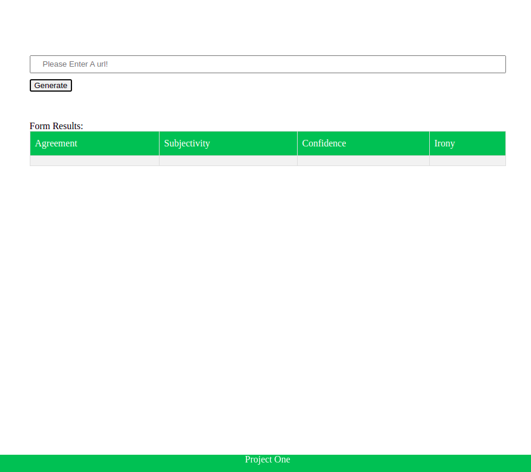

# Project goals
- Review how npm manages the app packages
- Review express
- How to use Webpack (plugins, loaders, entry)
- Workbox

# API
- MeaningCloud api
- Returns (subjectivity. confidence, irony, agreement)

# Usage and Installation
>Installin required packages: 
```
npm install
```
>Generat dist folder:
```
npm run build-prod
```
>Run server:
```
npm run start
```
> In case of coding and editing:
```
npm run build-dev
```
